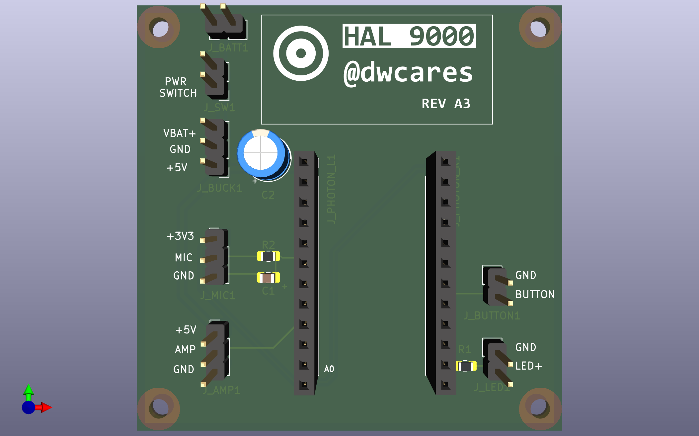

# HAL9000 Hardware

Custom carrier PCB for the HAL9000 voice assistant, designed in KiCad. This board is sized to mount inside the [Moebius Models 1:1 scale HAL9000 kit](https://www.amazon.com/Moebius-Models-HAL9000-Styrene-MOE20015/dp/B07SVCLLFW).



## Overview

This PCB provides a clean way to connect a Particle Photon to all the peripherals needed for the voice assistant:
- Microphone input with filtering
- Amplifier output for speaker
- Push-to-talk button
- Status LED
- Battery power with switch

## Files

| File | Description |
|------|-------------|
| `hal9000.kicad_pro` | KiCad project file |
| `hal9000.kicad_sch` | Schematic |
| `hal9000.kicad_pcb` | PCB layout |
| `hal9000_bom.csv` | Bill of materials |
| `manufacturing/` | Gerber files for fabrication |

## Bill of Materials

| Reference | Qty | Description | Notes |
|-----------|-----|-------------|-------|
| U1 | 1 | Particle Photon | Main MCU |
| J_PHOTON_L1, J_PHOTON_R1 | 2 | 12-pin Female Header 2.54mm | Photon sockets |
| J_BATT1 | 1 | 2-pin Header | Battery input (VBAT+, GND) |
| J_SW1 | 1 | 2-pin Header | Power switch |
| J_BUCK1 | 1 | 3-pin Header | Buck converter (VBAT+, GND, +5V) |
| J_MIC1 | 1 | 3-pin Header | Mic module (+3V3, MIC, GND) |
| J_AMP1 | 1 | 3-pin Header | Amp module (+5V, AMP, GND) |
| J_LED1 | 1 | 2-pin Header | LED (GND, LED+) |
| SW1 | 1 | 6mm Tactile Button | Push-to-talk |
| R1 | 1 | 220Ω 0805 | LED current limiter |
| R2 | 1 | 1kΩ 0805 | Mic input filter |
| C1 | 1 | 10nF 0805 | Mic input filter |
| C2 | 1 | 470µF Electrolytic | 5V bulk capacitance |

## External Modules

These modules connect via headers:

| Module | Description | Header |
|--------|-------------|--------|
| MAX9814 | Electret mic with AGC amplifier | J_MIC1 |
| PAM8302A | 2.5W Class-D mono amplifier | J_AMP1 |
| Buck/Boost Converter | 5V regulated output | J_BUCK1 |

## Pin Mapping

| Signal | Photon Pin | Description |
|--------|------------|-------------|
| MIC | A6 | Microphone analog input |
| AMP | A3 (DAC) | Speaker DAC output |
| BUTTON | D4 | Push-to-talk input |
| LED | D0 | Status LED output |

## Power

The board supports battery power with an external switch:

```
Battery ──► J_BATT1 ──► J_SW1 (switch) ──► Buck Converter ──► J_BUCK1 (+5V out)
                                                                    │
                                                              Photon VIN
                                                                    │
                                                              Onboard 3.3V reg
```

- **5V rail**: Powers Photon (via VIN), amplifier module
- **3.3V rail**: Powers microphone module (from Photon regulator)

## Manufacturing

The `manufacturing/` folder contains Gerber files ready for PCB fabrication. Upload to your preferred PCB manufacturer (JLCPCB, PCBWay, OSH Park, etc.).

## Assembly Tips

1. Solder SMD components first (R1, R2, C1)
2. Install female headers for Photon (J_PHOTON_L1, J_PHOTON_R1)
3. Install remaining through-hole headers and button
4. Add electrolytic capacitor C2 (observe polarity)
5. Connect external modules via headers
6. Insert Particle Photon

## License

MIT License - see [LICENSE](../LICENSE)
